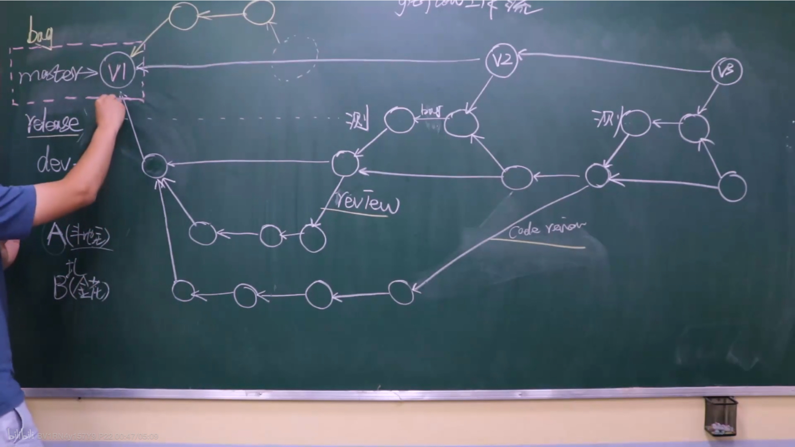

# 什么是Git
1. 是一个分布式，能够实现本地版本控制的软件。集中化版本控制 SVN 
2. 版本控制：文件 本地 集中式 分布式
### 2.1 第一阶段
想要让Git对一个目录进行版本控制需要如下步骤：
* 进入要管理的文件夹
* 执行初始化命令: `git init`
* 管理目录下的文件状态
```
git status
##新增的文件和修改后的文件都是红色
```
* 管理指定文件(红变绿)
```
git add 文件名
git add .
```
* 个人信息配置：用户名 邮箱
```
git config --global user.email ""
git config --global user.name ""
```
* 生成版本
```
git commit -m '描述信息'
```
* 查看版本记录: `git log`

# git三大区域
工作区：已管->新文件/修改文件（红色）{白<-红git checkout}  <-git reset HEAD

add . ->暂存区(绿色):  <-git reset soft 版本号

commit->版本库

## 回滚
1. v2->v1 :
` git reset --hard 版本号（git log）`
2. v1->v2
 ``` 0p             l0- mmm
查看之前的log :git reflog 
git reset --hard 版本号（git log）
 ```

# 分支
git branch 查看当前分支

创建dev分支:git branch dev

切换分支:git checkout 分支

到dev分支上开发:git checkout dev

分支合并:git merge(切换分支再合并)

删除分支:git branch -d 分支

若dev出现bug，回到master分支:`git checkout master`,里面的代码便是master里面的代码，不包含dev分支

若继续查看dev分支里面的代码:`git checkout dev`

出现bug后，则创建一个bug分支：`git branch bug`

把bug分支合并到master分支，先回master分支，再合并：`git merge bug`

bug分支则可删：`git branch -d bug`

dev开发完成后合并master分支需要先回master分支，再合并dev，会发生冲突，需要自己手动去改，再add、commit.


# 工作流

    ->master[C1]<-[C2]
        ->dev（开发）[C2]<-[C3]

在dev分支上开发

在开发dev时，如果master分支有更新，需要先把master上的代码合并到dev分支上。在dev分支上执行`git merge master`[仅一次]

把dev分支上的代码推送到远程dev分支上:`git push origin dev`

回家后继续开发:更新:`git pull origin dev`,开发完继续add,commit,push

dev开发完后，需要回到master分支，把dev分支合并，然后推送master分支上线:`git push origin master`,再回到dev,把master分支合并到dev分支，再把dev也推送上去:`git push origin dev`

`git pull origin dev`等同于:
````
git fetch origin dev
git merge origin/dev
````

# rebase(变基)应用场景

To:使得提交记录变得简洁

1. 多个记录变成一个记录(提交记录)

比如在git log 里面会有很多提交日志，如何整合成一个？
````
git rebase -i HEAD~3
表示最近的三条记录合并
到vim里面把第二行里面的pick变成s(把当前版本合并到上一个版本)下面的一样
已经合并
下一个vim修改整合，比如将v2&v3&v4
````

注意：合并记录时，建议不要合并那些已经push到仓库的


2. 场景2

master c1<-c2-<c4-<c5

dev   c2<-c3-<c5

把dev分支的记录整合到master一条线

把dev分支提交一次，写一个master分支提交到v4

然后切回到dev分支`git rebase master` 切回到master checkout，合并dev merge

3. 第三种场景

在公司提交到本地，回家继续开发木有

回到公司合并时会有冲突

会产生分叉

4. 注意事项
rebase相当于合并，如果产生冲突，解决冲突

在执行git rebase的时候，可能会产生冲突：解决方式它会告诉你执行git add...然后再执行`git rebase --continue` 

# byeond compare软件

快速解决冲突的软件


1. 安装
2. 在git配置
```
git config --local merge.tool bc3
git config --local mergetool.path '/user/local/bin/bcomp'
git config --local mergetool.keepBackup false
```
3. 解决冲突` git mergetool`

添加远程连接`git remote add origin 地址`

推送代码`git push origin dev`

拉取代码`git pull origin dev`

记录图形展示`git log --graph --pretty=format:"%h %s"`

# 多人开发

从dev拆出的分支

每天在自己的分支上提交

做完后，申请合并到dev，其中需要做代码检查。

大公司有的并不会直接提交到master，而是在master和dev之间设置一个release，然后提交到release,进行测试

功能做完后可删分支

gitflow工作流

## 实践
版本管理

git log里面的版本是一长串，使用tag命令管理

如`git tag -a v1 -m "第一版"`

本地有v1，然后推送：` git push origin --tags`



```
创建一个dev分支并切换到dev分支
git checkout -b dev 

把dev推送上去
git push origin dev
```

# 知识点补充

1. 配置文件

有三个配置文件
```
全局配置文件：~/。gitconfig
git config --global user.name 'bob'
git config --global user.email 'bob@xx.com'

项目配置文件：项目/.git/config
git config --local user.name 'bob'
git config --local user.email 'bob@xx.com'

系统配置文件：/etc/.gitconfig
git config --system user.name 'bob'
git config --system user.email 'bob@xx.com'
要root权限
```

## 免密码登录
* 在URL中体现

原来的地址：https://gitee.com/bob09/docs.git

修改的地址：https://用户名:密码gitee.com/bob09/docs.git

`git remote add origin https://用户名:密码gitee.com/bob09/docs.git`

`git push origin master`

* SSH实现
```
1. 生成公钥和私钥(默认存在~/ .ssh目录下，id_rsa.pub公钥、id_rsa私钥)
ssh-keygen
2. 拷贝公钥的内容，并设置到GitHub中
3.在git本地中配置ssh地址
    git remote add origin git@gitee.com:bob09/docs.git
4. 以后使用
    git push origin master
```

* git自动管理凭证

## git忽略文件

让Git不再管理当前目录下的某些文件；.gitignore
```
文件中：
a.h
b.h
*.h
!a.h
files/
```
可参考GitHub中搜索gitignore


## 任务管理
* issues，文档以及任务管理

* Wiki，对于项目的介绍
